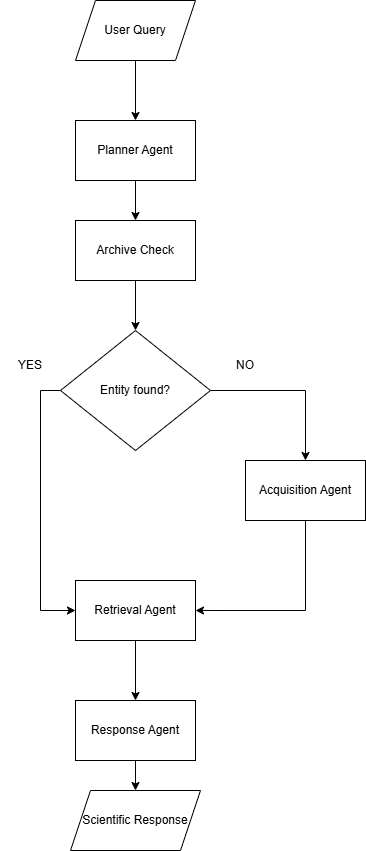

# Celestia Probe

Celestia Probe is an agentic space intelligence system that dynamically retrieves, acquires, and archives scientific information about celestial objects.

Built using LangGraph and a Retrieval-Augmented Generation pipeline, the system determines what a user is asking about, checks whether relevant knowledge already exists in its local archive, retrieves existing records when available, and automatically acquires new information when the archive is incomplete.

The system is presented through a custom CRT-inspired terminal interface that streams the execution of the agent pipeline in real time.

## Overview

Traditional Retrieval-Augmented Generation systems depend on a predefined knowledge base. When information is absent from the vector store, retrieval quality degrades or the system fails to provide grounded context.

Celestia Probe explores a dynamic archival approach.

Instead of treating the vector database as a static knowledge source, the system can identify missing entities, locate an appropriate external source, acquire and process the information, store it in the local vector archive, and continue the original query.

The result is a knowledge system that expands its archive as new celestial objects are explored.

## Key Features

- **Agentic Query Planning**  
  Analyzes user queries to identify the celestial entity, object type, query intent, and preferred scientific sources.

- **Dynamic Retrieval-Augmented Generation**  
  Searches the existing vector archive before initiating external knowledge acquisition.

- **Automatic Knowledge Acquisition**  
  Detects missing entities and retrieves information from NASA or Wikipedia based on source-routing rules.

- **Self-Expanding Vector Archive**  
  Processes newly acquired documents and stores their embeddings in Chroma for future retrieval.

- **Intent-Aware Retrieval**  
  Uses the detected query intent to retrieve context relevant to topics such as atmosphere, structure, formation, temperature, habitability, and missions.

- **LangGraph Agent Orchestration**  
  Coordinates planning, archive validation, acquisition, retrieval, and response generation through a state-based graph workflow.

- **Real-Time Execution Streaming**  
  Streams LangGraph node progress through a FastAPI backend, allowing the interface to display the actual execution state of the system.

- **Custom CRT Terminal Interface**  
  A standalone HTML, CSS, and JavaScript interface inspired by retro scientific terminals and deep-space computer systems.

## System Architecture

Celestia Probe uses a conditional LangGraph workflow that determines whether a requested celestial entity already exists in the local archive.

If the entity is available, the graph proceeds directly to retrieval. Missing entities are routed through the Acquisition Agent, which expands the archive before the original query continues.

<p align="center">
  
</p>
## Agent Pipeline

Celestia Probe uses a LangGraph workflow composed of five primary stages.

### 1. Planner

The Planner Agent analyzes the incoming query and produces a structured execution plan.

It extracts:

- Entity
- Celestial object type
- Query intent
- Preferred information sources

Example:

```json
{
  "entity": "Mars",
  "object_type": "Planet",
  "intent": "overview",
  "preferred_sources": [
    "NASA",
    "Wikipedia"
  ]
}
```

The planning output determines how later nodes process the request.

### 2. Archive Check

The Archive Check node determines whether the requested celestial entity already exists in the local Chroma vector database.

If relevant records exist, the system proceeds directly to retrieval.

If the entity is missing, the graph routes execution to the Acquisition Agent.

### 3. Acquisition

The Acquisition Agent expands the local archive when required.

The agent:

1. Selects a source using the Planner's preferred source order.
2. Locates an appropriate NASA or Wikipedia page.
3. Scrapes the source content.
4. Processes and chunks the extracted text.
5. Generates vector embeddings.
6. Stores the document in the Chroma archive.

Once acquisition is complete, the original query automatically continues through the graph.

### 4. Retrieval

The Retrieval Agent searches the vector archive using the entity and detected query intent.

This allows the system to retrieve context relevant to the specific question rather than returning general information about the celestial object.

### 5. Response Generation

The Response Agent synthesizes the retrieved context into a structured scientific archive record.

The response is grounded in the documents retrieved from the local archive.

## Real-Time Graph Streaming

The FastAPI backend executes the LangGraph workflow using streamed graph events.

Each completed node is emitted to the frontend as a Server-Sent Event.

Example:

```text
Planner Agent ............... COMPLETE
Archive Check ............... COMPLETE
Retrieval Agent ............. COMPLETE
Generating Scientific Report
```

When acquisition is required, the terminal reflects the additional execution path.

```text
Planner Agent ............... COMPLETE
Archive Check ............... COMPLETE
Archive Missing
Acquisition Agent ........... ACTIVE
Retrieval Agent ............. COMPLETE
Generating Scientific Report
```

These messages correspond to actual LangGraph execution states rather than simulated loading animations.

## Terminal Interface

Celestia Probe uses a custom frontend built with HTML, CSS, and vanilla JavaScript.

The interface is designed as a retro CRT scientific terminal and includes:

- CRT monitor framing
- Scanline effects
- Phosphor-inspired text glow
- Terminal boot sequence
- Keyboard-driven command input
- Typewriter output
- Automatic terminal scrolling
- Streamed agent execution states

The frontend communicates directly with the FastAPI API and renders streamed graph events inside the terminal.

## Technology Stack

| Layer | Technology |
| --- | --- |
| Agent Orchestration | LangGraph |
| LLM Integration | LangChain |
| Backend API | FastAPI |
| Vector Database | Chroma |
| Embeddings | Ollama Embeddings |
| Knowledge Sources | NASA, Wikipedia |
| Web Scraping | BeautifulSoup |
| Frontend | HTML, CSS, JavaScript |
| Data Validation | Pydantic |
| API Streaming | Server-Sent Events |

## Project Structure

```text
CelestiaProbe/
|
|-- agents/
|   |-- planner.py
|   |-- archive_check.py
|   |-- acquisition.py
|   |-- retrieval.py
|   `-- response.py
|
|-- rag/
|   |-- ingest.py
|   `-- vectorstore.py
|
|-- scrapers/
|   |-- nasa.py
|   `-- wikipedia.py
|
|-- search/
|   |-- search.py
|   `-- extract_entity.py
|
|-- ui/
|   |-- index.html
|   |-- styles.css
|   |-- terminal.js
|   `-- assets/
|
|-- api.py
|-- graph.py
|-- planner.py
|-- config.py
|-- requirements.txt
`-- README.md
```

## Installation

Clone the repository.

```bash
git clone <repository-url>
cd CelestiaProbe
```

Create a virtual environment.

```bash
python -m venv venv
```

Activate the environment.

### Windows

```bash
venv\Scripts\activate
```

### macOS / Linux

```bash
source venv/bin/activate
```

Install dependencies.

```bash
pip install -r requirements.txt
```

## Environment Configuration

Create a `.env` file in the project root.

```env
CHAT_MODEL=your_model_name
MODEL_PROVIDER=your_model_provider
```

Additional API credentials may be required depending on the configured language model provider.

Do not commit the `.env` file to version control.

## Running the Application

Start the FastAPI backend.

```bash
uvicorn api:app --reload
```

The API will run locally at:

```text
http://127.0.0.1:8000
```

Open the frontend through a local development server.

For example:

```bash
python -m http.server 5500 --directory ui
```

Then open:

```text
http://127.0.0.1:5500
```

The terminal will initialize and connect to the Celestia Probe backend.

## API

### POST `/query`

Processes a celestial query through the LangGraph pipeline.

Request:

```json
{
  "query": "Tell me about Mars"
}
```

The endpoint returns a Server-Sent Event stream.

Progress event:

```text
data: {"type": "progress", "node": "planner"}
```

Final answer event:

```text
data: {
  "type": "answer",
  "answer": "...",
  "entity": "Mars",
  "source": "NASA",
  "archive_url": "...",
  "object_type": "Planet"
}
```

## Example Workflow

Consider the query:

```text
> tell me about Ceres
```

The Planner identifies Ceres and determines the query intent.

The Archive Check searches the local vector database.

If Ceres is absent, the graph routes execution to the Acquisition Agent.

```text
Planner Agent ............... COMPLETE
Archive Check ............... COMPLETE
Archive Missing
```

The Acquisition Agent locates an appropriate source, processes the document, and stores it in the vector archive.

```text
Acquisition Agent ........... ACTIVE
Writing archive
```

The graph then resumes the original query.

```text
Retrieval Agent ............. COMPLETE
Generating Scientific Report
```

Future queries about Ceres can retrieve information directly from the expanded archive without repeating the acquisition process.

## Evaluation

Retrieval and response quality evaluation using RAGAS is planned for the evaluation pipeline.

The intended evaluation dimensions include:

- Faithfulness
- Answer Relevancy
- Context Precision
- Context Recall

Evaluation results and methodology will be documented as the project progresses.

## Current Limitations

- The current knowledge acquisition pipeline is limited to configured NASA and Wikipedia sources.
- Source routing is based on predefined celestial object categories.
- Local vector storage requires persistent storage configuration for production deployment.
- Embedding infrastructure must be configured appropriately for hosted deployment.
- The system currently focuses on text-based scientific retrieval and synthesis.

## Future Development

Planned extensions include:

- RAGAS-based retrieval and response evaluation
- Additional scientific sources and research archives
- Improved source confidence and provenance tracking
- Multi-source context synthesis
- Scientific citation rendering
- Expanded celestial object classification
- Persistent hosted vector storage
- Mission and habitability analysis agents
- Simulation-oriented scientific workflows

## Motivation

Celestia Probe began as an exploration of a simple question:

**What happens when a Retrieval-Augmented Generation system encounters knowledge that does not exist in its archive?**

Rather than treating missing context as a retrieval failure, Celestia Probe treats it as a trigger for knowledge acquisition.

The project explores how agent orchestration can transform a static RAG pipeline into a dynamically expanding information system while making the underlying execution process visible to the user.

## License

This project is intended for educational and research purposes.
